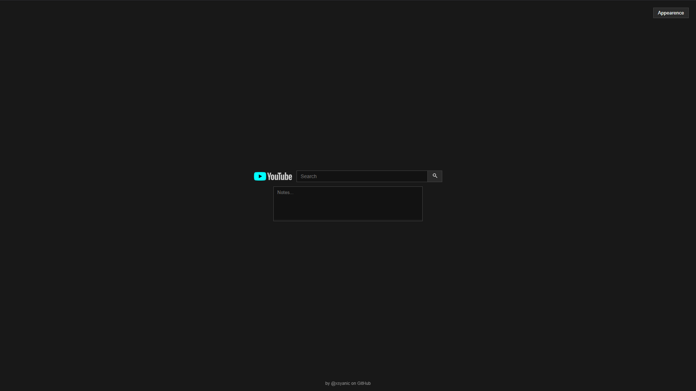
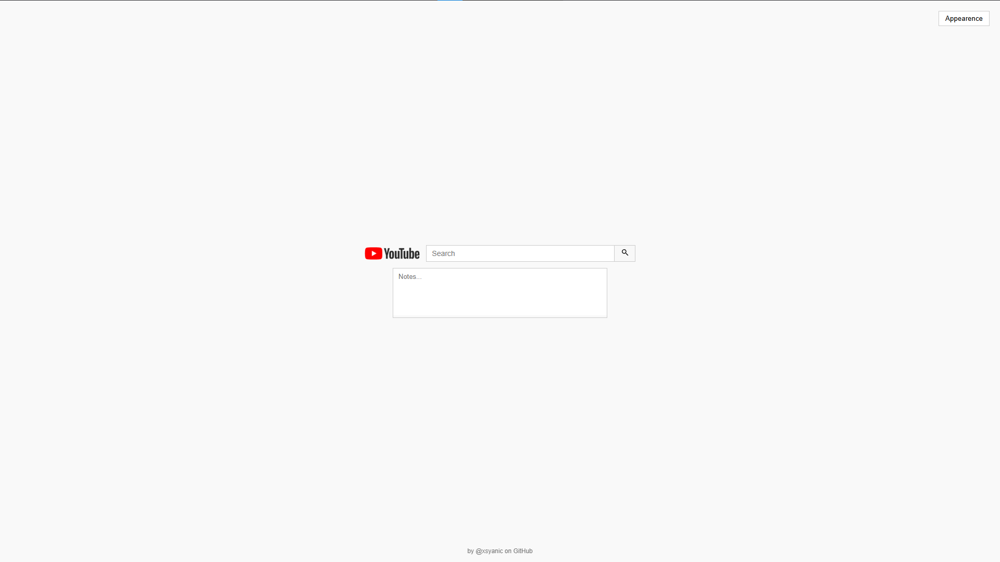

# YouTube Search Minimal

  
  

A minimal YouTube search page with built-in notes. Probably going to use it for my extension.

## Features

* Centered YouTube-style search bar
* Dark mode (default) with saved preference
* Notes area with auto-save
* Minimal and distraction-free UI

## Usage

Type a query and press **Enter** to open YouTube results.

Notes are automatically saved in your browser.

## Author

by [@xsyanic](https://github.com/xsyanic)
